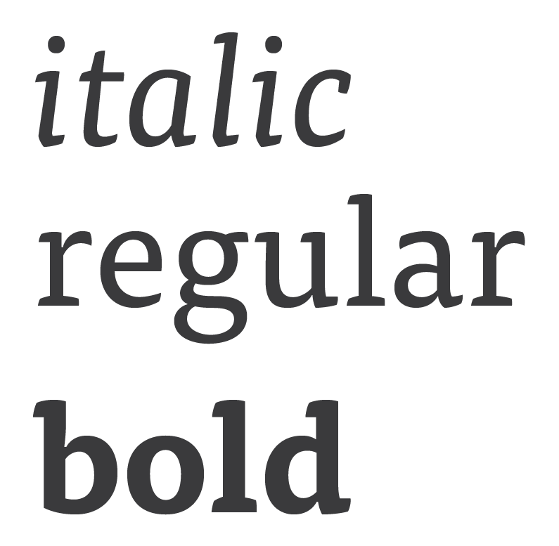
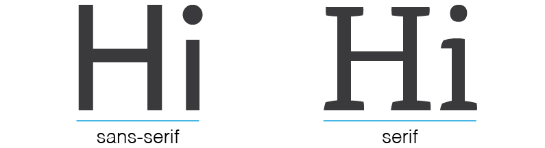
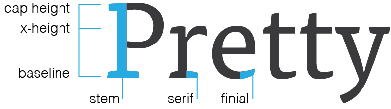
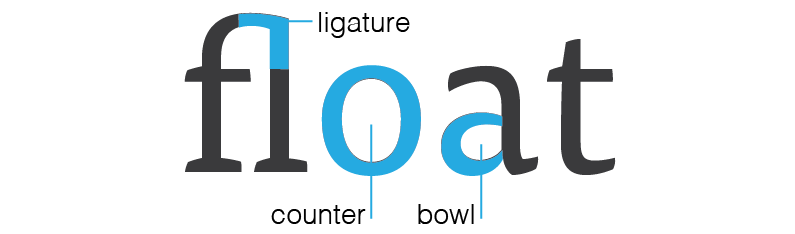
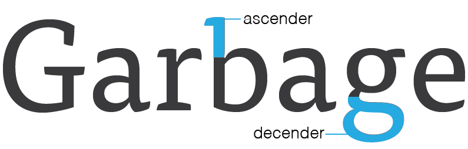

### Goals

By the end of this lesson, you will know/be able to:

* Understand the different between typeface and font
* Understand the different between serif and sans serif
* Have an understanding of the structure of letterforms

### What is Typography

Typography is a cornerstone of graphic design. The way we arrange letters and words on a screen is a huge, often unappreciated, part of how we communicate with users. Design is all about people and communication, and the words we choose and how we arrange them are arguably even more important then the images and colors we use.

As with any craft, there is quite a bit that goes into typography that may not be apparent to the end user. People build entire careers around designing and building typefaces, and there is a lot more to a letterform than whether or not it has serifs.

### Font vs Typeface

You've probably heard these two terms tossed around and used interchangeably, but they're actually two different things. A font is not a typeface and a typeface is not a font. Knowing the difference is the first step in understanding typography, so let's talk about what that is:

##### Typeface

A typeface is a collection of fonts. It is made up of the grouping of various italic, bold, thin weights that a type designer has recreated to give variation to their work.

You select a typeface and then use the fonts within it.

For example, the typeface Helvetica has Light, Bold, and Oblique fonts. You might you a bold font for headers, a light font for body copy, and an oblique (or italic) font for pull quotes.

##### Font

A font is each specific variation within a typeface. So, when we go to Google Fonts we choose a typeface like [Raleway](https://fonts.google.com/specimen/Raleway) and then select which fonts we actually want our page to load. In the past when the printed page was how text was used most, the fonts were what were actually used to print the typeface.

For a deeper walk through, read [this post](http://www.aiga.org/theyre-not-fonts/) from AIGA.

### Serif vs Sans Serif

There are two primary classifications of typefaces: serif and sans serif. A serif is, basically, a small line added at the end of a stroke in a letter. Sans serif is simply a letterform without a serif.

Serif fonts are seen in historic documents and type examples, and were used in everything from text chiseled into stone by the Romans to the manuscripts produced by the first printing presses. It is commonly thought that serifs increase legibility in large, printed blocks of text because the serifs lead the eye from letter to letter within words.

Sans serif fonts are a more modern approach to type design, and can be seen in the famous Swiss Style of the 20th Century. Despite the name, this style gained traction not only in Switzerland but in Russia, Germany, and the Netherlands in the 1920's before becoming a true international movement in the 1960's. In an effort to find beauty in purpose and simplicity, sans serif typefaces were created to follow the idea that "form follows function". These principles are highly relevant to the web, and this [Smashing Magazine article](https://www.smashingmagazine.com/2009/07/lessons-from-swiss-style-graphic-design/) is a fantastic dive into the history and modern applications of sans serif typefaces and the deep reaching influences of Swiss, or more correctly, International Style.

### Anatomy of a Letterform

Perhaps unsurprisingly, there are many typographic terms that come in handy when discussing letters in any amount of detail. Let's go over a few key terms that can help you speak type.

##### Cap Height
The height of a capital letter measured from the baseline.

##### X-height
The height of lowercase letters from the baseline, typically based on the height of the lowercase "x". X-height does not include ascenders or descenders, and it is measured against the main body of the lowercase letter.

##### Baseline

The line that all characters sit on, and the point from which x-height and cap height are measured.

##### Stem

The main, full length vertical stroke in most characters.

##### Serif

The extra stroke at the beginning and end of vertical and horizontal strokes of letterforms.

##### Finial

A tapered end of a letter, as seen on letters like "c" and "e".

##### Ligature

When two or more characters are joined to form one character. Ligatures can represent specific sounds but are often simply used to create more appealing and legible text.

##### Counter

The open space in a fully closed, or mostly close, letter, like "o" and "c". Some will say a counter only refers to a closed space, and refer to the the partially closed space in a "c" as an open counter.

##### Bowl

The fully closed, rounded part of a letter.

##### Ascender

The upward vertical stroke on a lowercase letter that extends upwards above the letter's x-height. Lowercase "b" and "h" are examples of letters with ascenders.

##### Descender

The downward vertical stroke and falls below the baseline. Lowercase "g" and "p" are examples of letters with descenders.

For a comprehensive and in-depth look at the anatomy of a letterform, take a look at [Typography Deconstructed](http://www.typographydeconstructed.com/).

### Resources

[Smashing Magazine: The Good, The Bad And The Great Examples Of Web Typography](https://www.smashingmagazine.com/2014/12/the-good-the-bad-and-the-great-examples-of-web-typography/)

[Smashing Magazine: Lessons From Swiss Style Graphic Design](https://www.smashingmagazine.com/2009/07/lessons-from-swiss-style-graphic-design/)

[Smashing Magazine: Tools And Resources For A More Meaningful Web Typography ](https://www.smashingmagazine.com/2016/03/meaningful-web-typography/)

[Thinking with Type: Letter](http://www.thinkingwithtype.com/contents/letter/)

[Typography Deconstructed](http://www.typographydeconstructed.com/)
