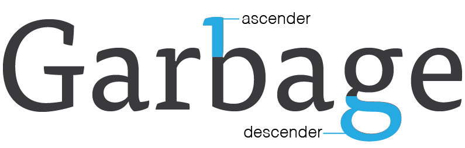

### Goals

By the end of this lesson, you will know/be able to:

* Have an understanding of the structure of letterforms
* Understand how to select font pairs
* Be a just a really huge nerd

### What is Typography

Typography is a cornerstone of graphic design. The way we arrange letters and words on a screen is a huge, often unappreciated, part of how we communicate with users. Design is all about people and communication, and the words we choose and how we arrange them are arguably even more important then the images and colors we use.

As with any craft, there is quite a bit that goes into typography that may not be apparent to the end user. People build entire careers around designing and building typefaces, and there is a lot more to a letterform than whether or not is has serifs.

### Font vs Typeface

You've probably heard these two terms tossed around and used interchangeably, but they're actually two different things. A font is not a typeface and a typeface is not a font. Knowing the difference is the first step in understanding typography, so let's talk about what that is:

##### Typeface

A typeface is a collection of fonts. It is made up of the grouping of various italic, bold, thin weights that a type designer has recreated to give variation to their work.

You select a typeface and then use the fonts within it.

For example, the typeface Helvetica has Light, Bold, and Oblique fonts. You might you a bold font for headers, a light font for body copy, and an oblique (or italic) font for pull quotes.

##### Font

A font is each specific variation within a typeface. So, when we go to Google Fonts we choose a typeface like [Raleway](https://fonts.google.com/specimen/Raleway) and then select which fonts we actually want our page to load. In the past when the printed page was how text was used most, the fonts were what were actually used to print the typeface.

For a deeper walk through, read [this post](http://www.aiga.org/theyre-not-fonts/) from AIGA.

### Anatomy of a Letterform

Perhaps unsurprisingly, there are many typographic terms that come in handy when discussing letters in any amount of detail. Let's go over a few key terms that can help you speak type.

##### Cap Height
The height of a capital letter measured from the baseline.

##### X-height
The height of lowercase letters from the baseline, typically based on the height of the lowercase "x". X-height does not include ascenders or descenders, and it is measured against the main body of the lowercase letter.

##### Baseline

The line that all characters sit on, and the point from which x-height and cap height are measured.

##### Stem

##### Serif

##### Finial

#### Guided Practice (We do)

* instructor and students both "doing"
* Examples: code-along, hot seat, discussion, question/answer, students telling instructor what to write, students pairing with close guidance from instructor

#### Independent/Pair Practice (You do)

* students "doing", instructor available as lifeline
* Examples: questions in a Gist, implementing feature, creating diagram

#### The Closing: ~5 min

* Check for understanding
* Discuss any clarifications or student misconceptions
* Review goals, further resources, and next steps

### Possible questions and/or misunderstandings

* What questions might students ask during class, and how will you respond?
* What concepts might students misunderstand, and why?

### Slides

* [Link to optional slides]()

### Video

* [Link to optional video]()

### Repository

* [Link to optional repo]()

### Outside Resources / Further Reading

* [Link to first outside resource]()
